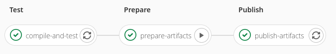

# Manual stages and dependencies in GitLab

> GitLab CI/CD is a tool built into GitLab for software development through 
> the continuous methodologies:
> + Continuous Integration (CI)
> + Continuous Delivery (CD)
> + Continuous Deployment (CD)  
>
> -- https://docs.gitlab.com/ee/ci/

However, _continuous_ does not means _automatic_ and, sometimes, you need a 
manual intervention to move to the next step.

In our case, we have a quite straightforward pipeline made of 3 simple stages:
 
  1. _Test_; run the tests
  2. _Prepare_; package the code
  3. _Publish_; publish the package to our Artifact repository

    stages:
      - test
      - prepare
      - publish

    compile-and-test:
      stage: test
      # ...

    prepare-artifacts:
      stage: prepare
      # ...

    publish-artifacts:
      stage: publish
      dependencies:
        - prepare-artifacts   
      # ...  
    

_Prepare_ and _Publish_ are differents stages because they have different 
requirements and a run on different runners.

Those stages are executed automatically from the mainstream branch. But there 
are some cases where we want to manually publish a package from a feature 
branch.

> `when` is used to implement jobs that are run in case of failure or despite 
> the failure.
> 
> `when` can be set to one of the following values:
>  
>  1. `on_success` - execute job only when all jobs from prior stages succeed 
>     (or are considered succeeding because they are marked allow_failure). 
>     This is the default.
>  2. `on_failure` - execute job only when at least one job from prior stages 
>     fails.
>  3. `always` - execute job regardless of the status of jobs from prior stages.
>  4. `manual` - execute job manually (added in GitLab 8.10). Read about manual 
>     actions below.
>  5. `delayed` - execute job after a certain period (added in GitLab 11.14). 
>     Read about delayed actions below.
>  6. `never`:
>    + With `rules`, don’t execute job.
>    + With `workflow:rules`, don’t run pipeline. 
>
> -- https://docs.gitlab.com/ee/ci/yaml/#when

Our first attempt was to add this keywod to the `publish-artifacts` job. But, 
because of the dependency, `prepare-artifacts` was always executed whether 
we want to publish it or not.

> The `needs` keyword enables executing jobs out-of-order, allowing you to 
> implement a directed acyclic graph in your `.gitlab-ci.yml`. 
> 
> -- https://docs.gitlab.com/ee/ci/yaml/#needs

It is not obvious but this will also block a job until the needed one is 
finished. Or, to say it the other way, it will run the job when the needed one 
is done.

    stages:
      - test
      - prepare
      - publish

    compile-and-test:
      stage: test
      script:
        - echo "Compile and test"

    prepare-artifacts:
      stage: prepare
      script:
        - echo "Prepare and package compiled sources"
      when: manual  

    publish-artifacts:
      stage: publish
      needs:
        - prepare-artifacts 
      script:
        - echo "Publishing prepared artifacts" 
  

Of course, we still want to have the automatic flow, but this can be easily 
achieved with `only` or `except` and YAML Anchors to avoid duplication.

 + https://docs.gitlab.com/ee/ci/yaml/#onlyexcept-basic
 + https://docs.gitlab.com/ee/ci/yaml/#anchors